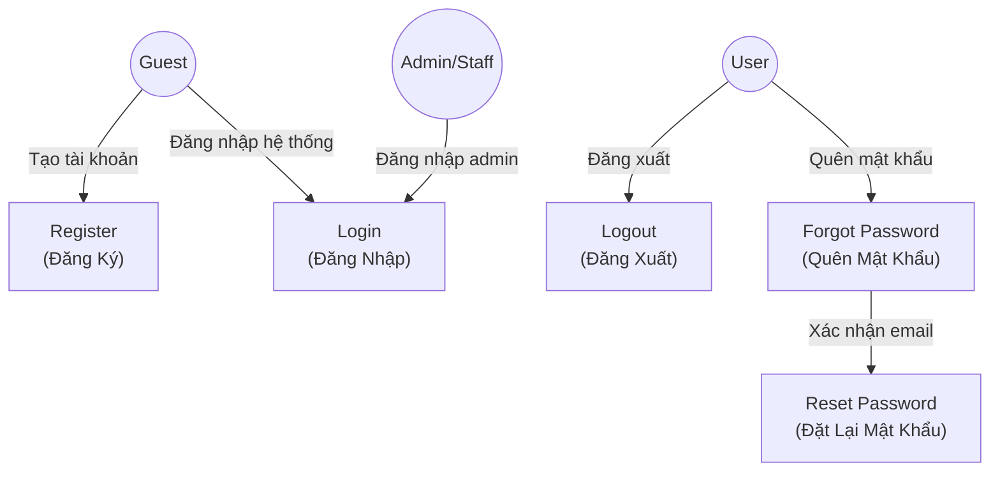
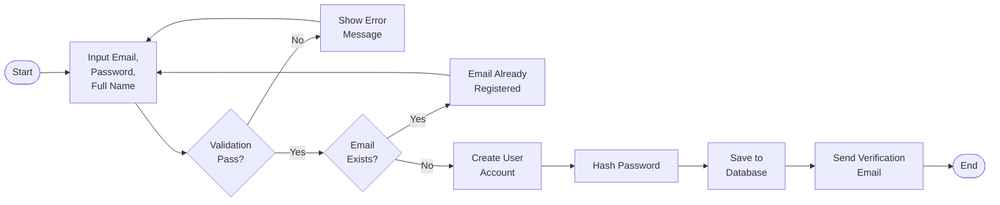
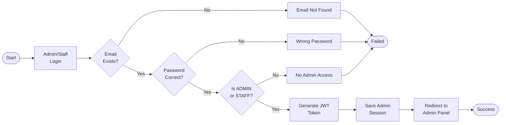
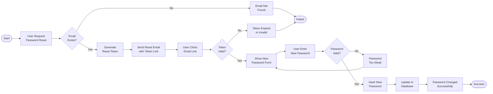

# Use Case Diagrams - Hotel Management System

## 1. Authentication Use Cases (Đăng Ký & Đăng Nhập)



## 2. User Registration Flow



## 3. User Login Flow


## 4. Admin/Staff Login Flow



## 5. Password Reset Flow



## 6. Complete Authentication Use Case Diagram

```mermaid
actor Guest as "Guest"
actor User as "User"
actor Admin as "Admin/Staff"

rectangle Authentication {
    usecase UC1 as "Register\n(Đăng Ký)"
    usecase UC2 as "Login\n(Đăng Nhập)"
    usecase UC3 as "Logout\n(Đăng Xuất)"
    usecase UC4 as "Forgot Password\n(Quên Mật Khẩu)"
    usecase UC5 as "Reset Password\n(Đặt Lại Mật Khẩu)"
    usecase UC6 as "Verify Email\n(Xác Minh Email)"
    usecase UC7 as "View Profile\n(Xem Hồ Sơ)"
    usecase UC8 as "Edit Profile\n(Chỉnh Sửa Hồ Sơ)"
}

Guest --> UC1
Guest --> UC2
User --> UC3
User --> UC7
User --> UC8
User --> UC4
UC4 --> UC5
UC1 --> UC6
Admin --> UC2
Admin --> UC3
```

## 7. Booking & Reservation Authentication

```mermaid
actor Guest as "Guest"
actor User as "User"
actor Staff as "Staff"
actor Admin as "Admin"

rectangle "Booking Management" {
    usecase UC_Book as "Book Room\n(Đặt Phòng)"
    usecase UC_View as "View Bookings\n(Xem Đặt Phòng)"
    usecase UC_Cancel as "Cancel Booking\n(Hủy Đặt Phòng)"
    usecase UC_UpdateStatus as "Update Booking Status\n(Cập Nhật Trạng Thái)"
}

Guest --> UC_Book
User --> UC_Book
User --> UC_View
User --> UC_Cancel
Staff --> UC_View
Staff --> UC_UpdateStatus
Admin --> UC_View
Admin --> UC_UpdateStatus
Admin --> UC_Cancel
```

## 8. Food Service Authentication

```mermaid
actor Guest as "Guest"
actor User as "User"
actor Staff as "Staff"
actor Admin as "Admin"

rectangle "Food Service Management" {
    usecase UC_Menu as "View Menu\n(Xem Thực Đơn)"
    usecase UC_Order as "Order Food\n(Đặt Món Ăn)"
    usecase UC_ViewOrder as "View Food Orders\n(Xem Đơn Hàng)"
    usecase UC_UpdateOrder as "Update Order Status\n(Cập Nhật Trạng Thái)"
    usecase UC_ManageMenu as "Manage Menu Items\n(Quản Lý Thực Đơn)"
}

Guest --> UC_Menu
User --> UC_Menu
User --> UC_Order
User --> UC_ViewOrder
Staff --> UC_ViewOrder
Staff --> UC_UpdateOrder
Admin --> UC_Menu
Admin --> UC_Order
Admin --> UC_ViewOrder
Admin --> UC_UpdateOrder
Admin --> UC_ManageMenu
```

## 9. Restaurant Reservation Authentication

```mermaid
actor Guest as "Guest"
actor User as "User"
actor Staff as "Staff"
actor Admin as "Admin"

rectangle "Restaurant Reservation" {
    usecase UC_ViewTables as "View Available Tables\n(Xem Bàn Trống)"
    usecase UC_Reserve as "Reserve Table\n(Đặt Bàn)"
    usecase UC_ViewRes as "View Reservations\n(Xem Đặt Bàn)"
    usecase UC_UpdateRes as "Update Reservation\n(Cập Nhật Đặt Bàn)"
    usecase UC_ManageTables as "Manage Tables\n(Quản Lý Bàn)"
}

Guest --> UC_ViewTables
User --> UC_ViewTables
User --> UC_Reserve
User --> UC_ViewRes
Staff --> UC_ViewRes
Staff --> UC_UpdateRes
Admin --> UC_ViewTables
Admin --> UC_Reserve
Admin --> UC_ViewRes
Admin --> UC_UpdateRes
Admin --> UC_ManageTables
```

## 10. Admin Panel Authentication

```mermaid
actor Staff as "Staff"
actor Admin as "Admin"

rectangle "Admin Panel" {
    usecase UC_Dashboard as "View Dashboard\n(Xem Dashboard)"
    usecase UC_ViewUsers as "Manage Users\n(Quản Lý Users)"
    usecase UC_ViewRooms as "Manage Rooms\n(Quản Lý Phòng)"
    usecase UC_Analytics as "View Analytics\n(Xem Phân Tích)"
    usecase UC_Reports as "Generate Reports\n(Tạo Báo Cáo)"
}

Staff --> UC_Dashboard
Staff --> UC_Analytics
Admin --> UC_Dashboard
Admin --> UC_ViewUsers
Admin --> UC_ViewRooms
Admin --> UC_Analytics
Admin --> UC_Reports
```

## Role & Permission Matrix

| Feature | Guest | User | Staff | Admin |
|---------|-------|------|-------|-------|
| **Authentication** | | | | |
| Register | ✅ | - | - | - |
| Login | ✅ | ✅ | ✅ | ✅ |
| Logout | - | ✅ | ✅ | ✅ |
| View Profile | - | ✅ | ✅ | ✅ |
| Edit Profile | - | ✅ | ✅ | ✅ |
| **Room Booking** | | | | |
| View Rooms | ✅ | ✅ | - | ✅ |
| Book Room | ✅* | ✅ | - | ✅ |
| View My Bookings | - | ✅ | - | - |
| View All Bookings | - | - | ✅ | ✅ |
| Update Status | - | - | ✅ | ✅ |
| Delete Booking | - | - | - | ✅ |
| **Food Service** | | | | |
| View Menu | ✅ | ✅ | - | ✅ |
| Order Food | ✅* | ✅ | - | ✅ |
| View My Orders | - | ✅ | - | - |
| View All Orders | - | - | ✅ | ✅ |
| Update Order Status | - | - | ✅ | ✅ |
| Manage Menu | - | - | - | ✅ |
| **Restaurant** | | | | |
| View Tables | ✅ | ✅ | - | ✅ |
| Reserve Table | ✅* | ✅ | - | ✅ |
| View My Reservations | - | ✅ | - | - |
| View All Reservations | - | - | ✅ | ✅ |
| Update Reservation | - | - | ✅ | ✅ |
| Manage Tables | - | - | - | ✅ |
| **Admin** | | | | |
| Dashboard | - | - | ✅ | ✅ |
| Manage Users | - | - | - | ✅ |
| Manage Rooms | - | - | - | ✅ |
| Analytics | - | - | ✅ | ✅ |
| Reports | - | - | - | ✅ |

*Guests need to provide info but don't need to login

## Key Points - Authentication & Authorization

1. **Guest Users** - Có thể xem rooms/menu/tables nhưng đặt phòng/order cần provide thông tin
2. **Regular Users** - Đăng ký/đăng nhập để đặt phòng, đặt món ăn, đặt bàn
3. **STAFF** - Xem & cập nhật trạng thái của bookings, food orders, reservations (read-only dashboard)
4. **ADMIN** - Full control: quản lý users, rooms, coupons, analytics, reports

## Implementation Stack

- **Backend**: Spring Security + JWT tokens
- **Frontend**: AuthContext + AuthService for role-based access control
- **Method Security**: `@EnableMethodSecurity` + `@PreAuthorize` annotations
- **Role Hierarchy**: USER < STAFF < ADMIN
